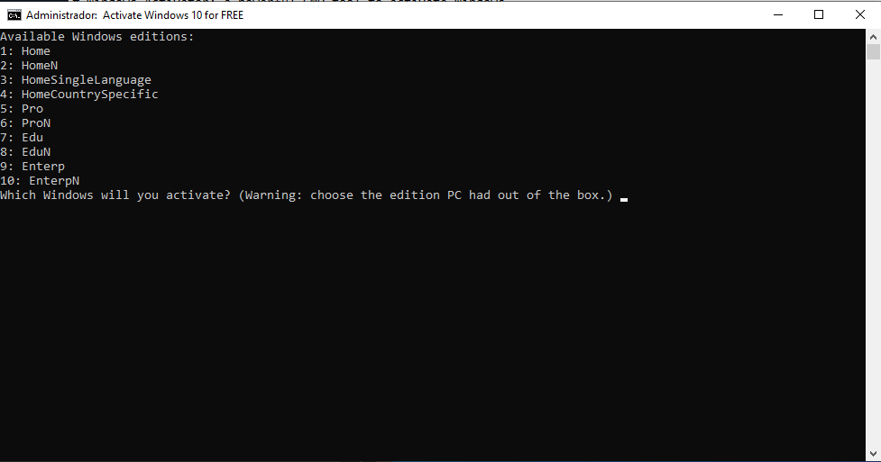

# Windows Activator: a powerful CMD tool to activate Windows.

## How to use it?

Simple: right-click the .cmd file and click on [Run as administrator]. Then click "Yes", and you will be prompted to select a Windows edition:



When you choose that edition (number between 1 and 10), press [Enter] and let it activate your Windows. The three main commands that this file uses are:

```cmd
slmgr /ipk [license-key-selected]
slmgr /skms kms8.msguides.com
slmgr /ato
```

## FAQ

Q: I got error 0xC004F074. What do I do?

A: Error 0xC004F074 means that the server is busy, or maybe your Internet connection is unstable or inexistent. The program will ask you to try again. If you want to, make sure that your Internet connection is stable, then type Y and press [Enter].